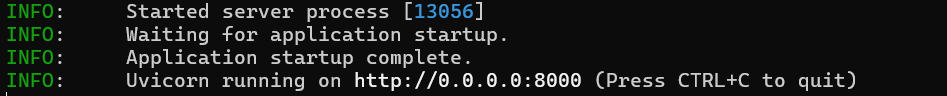

# Gemini to OPENAI

## Introduce

This is a simple Python FastAPI server with the following main functionalities:

- Receives POST requests to `/v1/chat/completions` and transforms them according to the following specifications:

  | OPENAI API ENDPOINT                                          | GEMINI API                                                   |
  | ------------------------------------------------------------ | ------------------------------------------------------------ |
  | `{"model": ModelID}`                                         | `https://generativelanguage.googleapis.com/v1beta/models/ModelID:generateContent?key=$GEMINI_API_KEY` |
  | `{"messages": [{"role": "system", "content": System_prompt}]}` | `{"system_instruction": {"parts": [{"text": System_prompt}]}}` |
  | `{"messages": [{"role": "user", "content": User_prompt}]}`   | `{"contents": [{"role": "user", "parts": [{"text": User_prompt}]}]}` |
  | `{"messages": [{"role": "assistant", "content": Model_prompt}]}` | `{"contents": [{"role": "model", "parts": [{"text": User_prompt}]}]}` |

  See `main.py` for more transformations.

  ## Usage

  In the project root directory, first enter the following command to install dependencies:

  ```shell
  pip install -r requirements.txt
  ```

  Then copy `.env.example` to `.env` in the project root directory, and modify the following content, which is variable information:

  | `BASE_URL`       | Must end with "/" Default is `https://generativelanguage.googleapis.com/` Required. |
  | ---------------- | ------------------------------------------------------------ |
  | `OPENAI_API_KEY` | Deprecated, no effect, meaning any apiKey you fill in when requesting is irrelevant. |
  | `GEMINI_API_KEY` | Required, used for requesting Gemini API.                    |

  Then run the following command to execute:

  ```shell
  python main.py
  ```

  If you see output similar to the following, it means it's running:

  

Then, `http://127.0.0.1:8000` is the OpenAI API compatible server address.

## Supported

- Chat
- Get Models
- Context understanding, multi-turn chat.

## To-dos

- [ ] Streaming
- [ ] Support Gemma
- [ ] Upload File
- [ ] Generate Files
- [ ] Support VertexAI