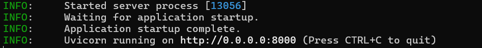

# Gemini to OPENAI

## 介绍

这是一个简单的Python FASTAPI服务器，它主要有以下功能：

- 接收`/v1/chat/completions`的`POST`请求，并按照以下规范进行转化：

  | OPENAI API ENDPOINT                                          | GEMINI API                                                   |
  | ------------------------------------------------------------ | ------------------------------------------------------------ |
  | `{"model": ModelID}`                                         | `https://generativelanguage.googleapis.com/v1beta/models/ModelID:generateContent?key=$GEMINI_API_KEY` |
  | `{"messages": [{"role": "system", "content": System_prompt}]}` | `{"system_instruction": {"parts": [{"text": System_prompt}]}}` |
  | `{"messages": [{"role": "user", "content": User_prompt}]}`   | `{"contents": [{"role": "user", "parts": [{"text": User_prompt}]}]}` |
  | `{"messages": [{"role": "assistant", "content": Model_prompt}]}` | `{"contents": [{"role": "model", "parts": [{"text": User_prompt}]}]}` |

  更多转化详见`main.py`

  ## 使用方法

  在项目根目录，先输入以下命令来安装依赖

  ```shell
  pip install -r requirements.txt
  ```

  然后填写复制项目根目录下的`.env.example`到`.env`，并修改以下内容，这是变量信息：

  | `BASE_URL`       | 结尾必须存在"/" 默认为`https://generativelanguage.googleapis.com/` 必填 |
  | ---------------- | ------------------------------------------------------------ |
  | `OPENAI_API_KEY` | 已废弃，没作用，也就是说你请求时填什么apiKey都无所谓         |
  | `GEMINI_API_KEY` | 用于请求Gemini API时候用的key 必填                           |

  然后运行以下命令来运行：

  ```shell
  python main.py
  ```

  看到类似于以下的输出，就代表正在运行了：

  

然后，`http://127.0.0.1:8000`就是OPENAI API兼容的服务器地址啦！

## 支持功能：

- 正常聊天
- 获取模型
- 上下文理解，多轮聊天

## 待办

- [ ] 支持流式传输
- [x] 支持gemma
- [ ] 上传文件
- [ ] 图像生成